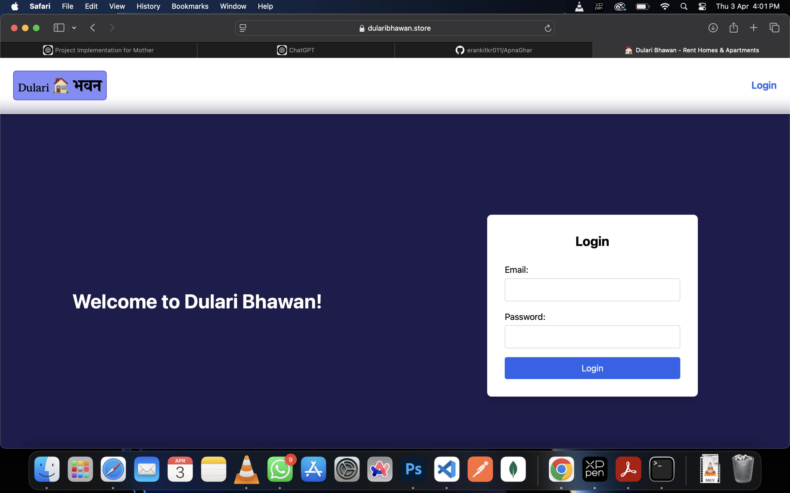
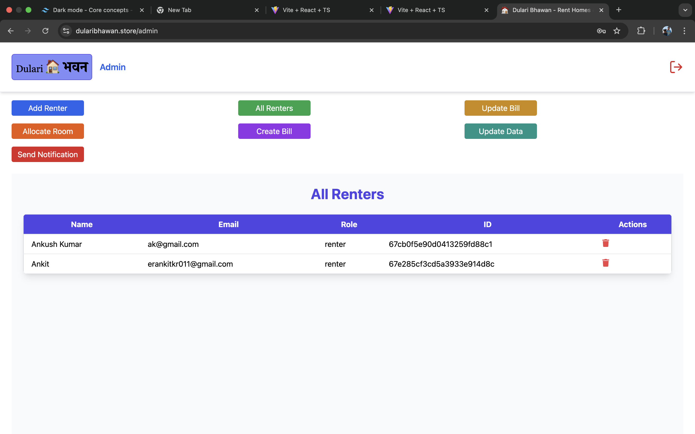
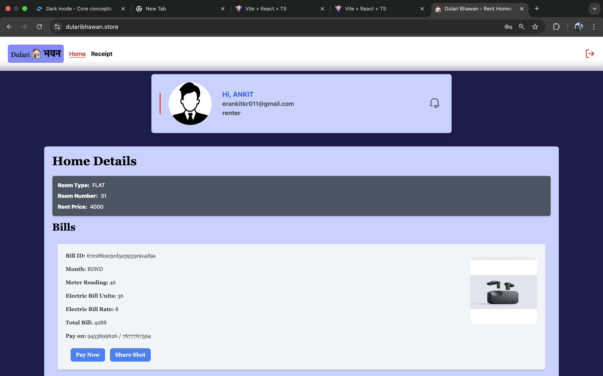
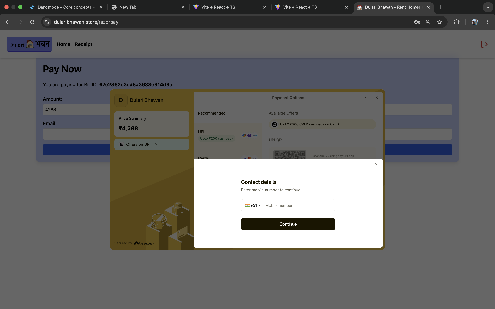

# 🏠 Dulari Bhawan: Home Rental Management System

A full-stack **home rental management** platform designed to **simplify room allocations, renter management, billing, and payments**. Built with **React, Node.js, and MongoDB**, the platform ensures a smooth experience for both **tenants and administrators**.

🚀 **Live Demo:** [Dulari Bhawan](https://www.dularibhawan.store)

---

## ✨ Features

✅ **Admin Dashboard:** Manage renters, rooms, and payments efficiently.  
✅ **Seamless Online Payments:** Integrated **Razorpay** for secure transactions.  
✅ **Email Notifications:** Automated alerts using **Nodemailer**.  
✅ **Cloud Media Storage:** Efficient image handling via **Cloudinary**.  
✅ **Role-Based Access Control (RBAC):** Secure access to administrative features.  
✅ **SEO Optimized:** Structured URLs and meta tags for better search visibility.  
✅ **Deployed on AWS:** Scalable and reliable hosting using **EC2**.

---

## 🛠️ Tech Stack

**Frontend:**

- React.js, Tailwind CSS
- JavaScript

**Backend:**

- Node.js, Express.js
- MongoDB, Mongoose

**Tools & Services:**

- Razorpay (Payments)
- Nodemailer (Emails)
- Cloudinary (Media Storage)
- AWS EC2 (Deployment)
- Git, GitHub, Postman

---

## 🚀 Getting Started

### **1️⃣ Clone the Repository**

```sh
git clone https://github.com/erankitkr011/ApnaGhar.git
cd ApnaGhar

```

## 🖼️ Screenshots

| Login                      | Admin Dashboard                               | Renter Dashboard                                | Payment Integration            |
| -------------------------- | --------------------------------------------- | ----------------------------------------------- | ------------------------------ |
|  |  |  |  |
